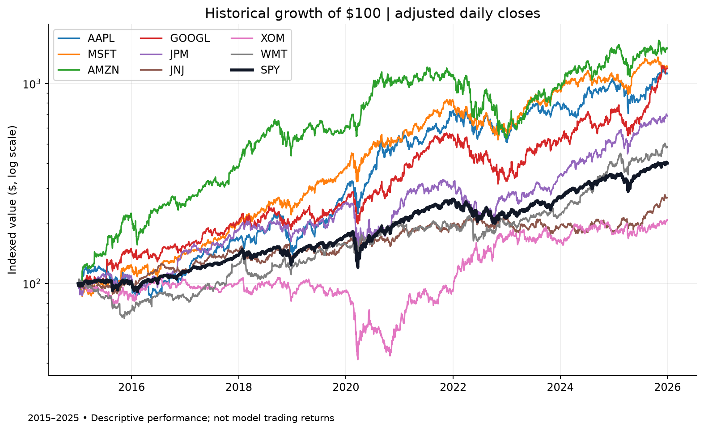
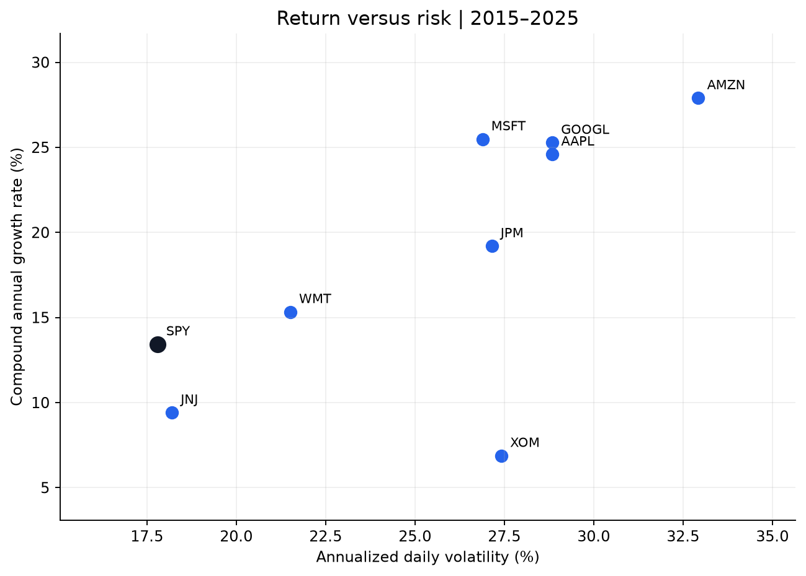
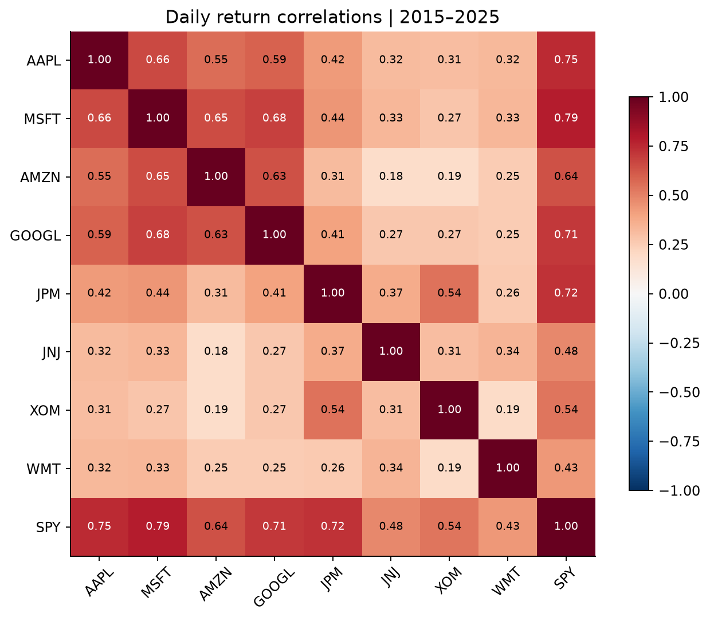
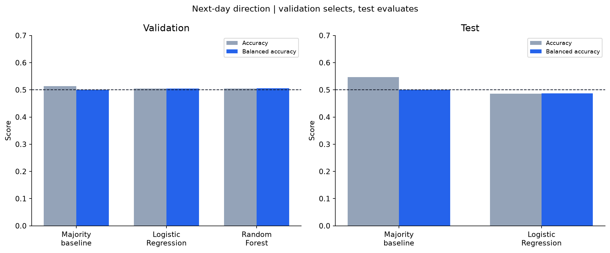
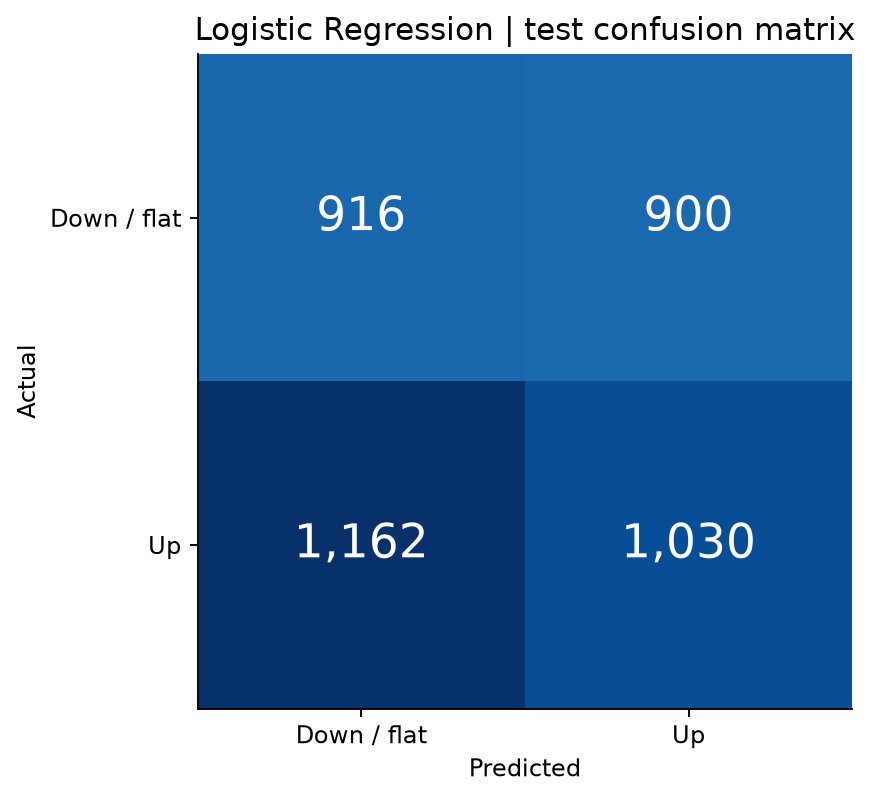

# Original experiment: methods and results

**Scope:** this document preserves the original 2015–2025 study. See [the current overview](../README.md) for the later accuracy-focused follow-up. The original test dates have since been inspected and reused as development data.

I wanted to try a simple idea: take companies I recognize, look at how their stocks behaved, and see whether recent price and volume patterns say anything useful about the next trading day. I used eight stocks and SPY, starting with historical returns and risk before trying two classification models.

**The models didn't beat the basic guess.** Logistic Regression finished with **48.71% balanced accuracy** on the 2024–2025 test period, compared with **50.00%** for the majority baseline. That's the main result of this project. The interesting part is why an “always up” prediction can look decent on some metrics, and how easy it would be to overstate what a model has learned.

**Ryan Dominguez** · CS at Montclair State University · Expected graduation: December 2027

## What I wanted to find out

The first two questions help compare historical investments; the last one is a much harder prediction problem:

1. How did eight major companies perform relative to SPY over 2015–2025?
2. Which names combined higher historical growth with higher volatility or deeper drawdowns?
3. Can inexpensive, interpretable historical signals classify the next trading session's direction better than a naive baseline?

Everything runs from one Python script. It downloads the data, checks it, builds the features, compares the models, and saves five charts plus the results. This is a learning project about market data and model evaluation, not a trading strategy or investment recommendation.



## The stocks and the data

- **Source:** Yahoo Finance through [yfinance](https://ranaroussi.github.io/yfinance/reference/api/yfinance.download.html), downloaded October 1, 2026.
- **Window:** January 2, 2015–December 31, 2025; the download's exclusive end date is January 1, 2026.
- **Stocks:** AAPL, MSFT, AMZN, GOOGL, JPM, JNJ, XOM, WMT.
- **Benchmark:** SPY; used for comparison and market-context features, not as a modeled stock.
- **Coverage:** 24,894 daily OHLCV rows across nine instruments and 2,766 trading dates.
- **Adjustment:** `auto_adjust=True` adjusts historical OHLC for corporate actions. Adjusted-close growth is an approximate total-return proxy, not a simulated investment account.

Before doing any analysis, I check for duplicate dates within a ticker, missing values, impossible prices, and missing trading days relative to SPY. The script stops if something looks wrong. Filling a missing price with yesterday's value would create an artificial zero return, so I left that out. Matching SPY's dates is a useful check, though it doesn't independently verify the exchange calendar.

Downloaded prices stay in the ignored `data/` folder. Source settings, package versions, and a SHA-256 fingerprint are recorded in [the run manifest](../results/run_manifest.json). The local cache is reused by default. Raw provider data is not redistributed in this repository; review the provider's terms for your intended use. A fresh download may reflect provider revisions and produce slightly different results.

## What happened to $100?

| Instrument | Annualized growth (CAGR) | Annualized volatility | Maximum drawdown |
|---|---:|---:|---:|
| AMZN | 27.90% | 32.93% | -56.15% |
| MSFT | 25.48% | 26.89% | -37.15% |
| AAPL | 24.59% | 28.85% | -38.52% |
| SPY | 13.43% | 17.79% | -33.72% |
| XOM | 6.88% | 27.42% | -61.34% |

AMZN had the highest annualized growth in this group, but that came with much higher volatility than SPY and a drawdown of more than 56%. XOM had the deepest drawdown. Looking only at the final return would miss a lot of what holding these stocks was like. None of this tells us which stock will perform best next.

CAGR uses elapsed calendar years; volatility is the standard deviation of daily returns multiplied by the square root of 252; maximum drawdown is the worst decline from a previous daily closing high. See [all nine instruments](../results/performance_summary.csv).





## What the models get to see

I kept the inputs fairly small: 15 features built from price, volume, and SPY. Each stock gets its own rolling calculations, and then I combine the rows to train one model across all eight companies. I use returns and ratios instead of raw dollar prices so a high-priced stock isn't automatically treated as a stronger signal. Ticker names aren't model inputs either.

| Feature group | Variables | Purpose |
|---|---|---|
| Recent returns | Current daily return; daily return lagged one and two sessions | Short-term direction and reversal |
| Momentum | 5- and 20-session close-to-close returns | Recent trend |
| Moving averages | Close / trailing 10- and 20-session average minus one | Relative position within a trend |
| Volatility | Trailing 20-session daily-return standard deviation | Recent variability |
| Volume | One-session volume change; volume / trailing 20-session average minus one | Relative activity |
| Intraday | (High - Low) / Close; Close / Open minus one | Session range and direction |
| Market context | SPY daily return; SPY 5-session return; stock return minus SPY return | Broad-market movement |

**Forecast time:** after session `t` closes, once its complete daily bar is available.

**Target:** `1` if the adjusted close at `t+1` exceeds the adjusted close at `t`; otherwise `0` (down or exactly flat). This is direction classification, not price forecasting. The final observation for each ticker has an unknown future label and is removed rather than mislabeled as zero. Initial rolling-window warm-up rows are also removed.

## Giving the models a fair test

The rule here is simple: the model can't learn from the future. I split by date, with all stocks on the same side of each cutoff. Randomly shuffling stock-day rows would make the experiment much less realistic.

| Partition | Feature dates | Latest label date | Stock-day rows | Up rate |
|---|---|---|---:|---:|
| Training | 2015-02-02–2021-12-30 | 2021-12-31 | 13,936 | 52.71% |
| Validation | 2022-01-03–2023-12-28 | 2023-12-29 | 4,000 | 51.35% |
| Test | 2024-01-02–2025-12-30 | 2025-12-31 | 4,008 | 54.69% |

- Rolling windows look backward and include today's completed session. Only target creation uses a forward shift.
- Sixteen boundary rows are purged so a training or validation label cannot enter the next partition. Another 168 rows are excluded for warm-up or unknown final labels.
- Standardization is inside the Logistic Regression pipeline, fitted only on training data during selection.
- Models and hyperparameters are fixed; there is no search over test results and no optimized classification threshold.
- Validation selects the model. The selected model and baseline are then refitted on the retained training + validation rows and evaluated on the test period. The conservative boundary exclusions remain during refitting.
- Later test-day features may use earlier observed test-day prices: these would be available at prediction time. They never use future test prices.
- Full-period descriptive charts are generated after selection and do not feed the model-selection rule.
- Tests perturb future prices and verify that earlier features remain unchanged. They also verify target direction, unknown final labels, boundary purging, and invalid-data rejection.

## Why these two models?

**First, the basic guess:** `DummyClassifier(strategy="most_frequent")`. It predicts whichever outcome was more common in training. Here, that means “up” every day. A model needs to justify being more complicated than that.

**Logistic Regression:** a simple linear starting point. The inputs are standardized inside the training pipeline, with `C=1.0`, balanced class weights, and up to 2,000 optimization iterations.

**Random Forest:** a way to test whether combinations of signals help. I kept it shallow: 200 trees, maximum depth 5, and at least 100 observations per leaf. It also uses balanced class weights and seed 42. I didn't run a large parameter search.

**Predefined rule:** maximize validation balanced accuracy. If models are within **0.001** (0.1 percentage point), favor simplicity in the order baseline, Logistic Regression, Random Forest. Use the default 0.5 decision threshold throughout.

Random Forest scored 50.54% validation balanced accuracy; Logistic Regression scored 50.44%. The unrounded gap was inside that tolerance, so **Logistic Regression was selected**. Neither validation result gave much reason to expect a useful edge.

## Did the predictions help?

| Partition | Model | Accuracy | Balanced accuracy | Precision (up) | Recall (up) | F1 (up) | ROC-AUC |
|---|---|---:|---:|---:|---:|---:|---:|
| Validation | Majority baseline | 51.35% | 50.00% | 51.35% | 100.00% | 0.679 | 0.500 |
| Validation | Logistic Regression | 50.45% | 50.44% | 51.78% | 50.93% | 0.514 | 0.495 |
| Validation | Random Forest | 50.48% | 50.54% | 51.91% | 48.30% | 0.500 | 0.497 |
| Test | Majority baseline | 54.69% | 50.00% | 54.69% | 100.00% | 0.707 | 0.500 |
| Test | Logistic Regression | 48.55% | 48.71% | 53.37% | 46.99% | 0.500 | 0.484 |

No, not in this test. Logistic Regression fell behind the baseline by **6.14 percentage points in accuracy** and **1.29 percentage points in balanced accuracy**. I kept the result instead of changing the features after looking at the test set. Once that later data has influenced the choices, it isn't an untouched test anymore.





The baseline's 0.707 F1 score is a good example of why I don't want to judge this with one number. It never predicts a down day. Here's how I read each metric:

- **Accuracy:** what fraction of all predictions were correct? It can favor the more common class.
- **Balanced accuracy:** average of recall for up and down/flat. An always-up classifier scores 50% when both classes are present.
- **Precision for up:** among predicted up days, how many actually rose?
- **Recall for up:** among actual up days, how many did the model identify?
- **F1 for up:** harmonic mean of up precision and up recall. It does not reward recognizing down days directly; the always-up baseline illustrates why it should not be the only metric here.
- **ROC-AUC:** how well probability scores rank up observations above down/flat observations across thresholds. A constant score yields 0.5. These probabilities are not calibrated investment probabilities, especially with balanced class weights.

Exact values, stock-level metrics, and test predictions are in [results/](../results/). Stocks on the same day are correlated; 4,008 stock-day rows are not 4,008 independent market scenarios. No statistical significance claim is made.

## Try it yourself

Requires **Python 3.12** and internet access for the first data download. Tested with Python 3.12.14 on Windows. Jupyter, API keys, and paid services are not required.

```powershell
git clone https://github.com/ryandom-codes/stock-market-performance-analysis.git
cd stock-market-performance-analysis
py -3.12 -m venv .venv
.\.venv\Scripts\python.exe -m pip install -r requirements.txt
.\.venv\Scripts\python.exe src\market_analysis.py
.\.venv\Scripts\python.exe -m unittest discover -s tests -v
```

No activation command is required. In VS Code, select `.venv\Scripts\python.exe` as the Python interpreter. If `py -3.12` is unavailable, install Python 3.12 from [python.org](https://www.python.org/downloads/) or use an existing Python 3.12 executable in that command.

To replace the local data snapshot deliberately:

```powershell
.\.venv\Scripts\python.exe src\market_analysis.py --refresh
```

The script resolves output paths relative to itself, so it also works when invoked from another directory. Network errors, rate limits, or data-quality failures stop execution; rerun after resolving the error. A successful first run creates an offline cache. Repeated runs using that cache reproduce the analysis without another market-data request.

## Repository structure

```text
stock-market-performance-analysis/
├── README.md
├── requirements.txt
├── .gitignore
├── src/
│   └── market_analysis.py
├── tests/
│   └── test_integrity.py
├── data/
│   └── .gitkeep                  # Downloaded cache remains local
├── figures/
│   ├── historical_growth.png
│   ├── risk_return.png
│   ├── return_correlations.png
│   ├── model_comparison.png
│   └── confusion_matrix.png
└── results/
    ├── performance_summary.csv
    ├── model_metrics.csv
    ├── test_metrics_by_stock.csv
    ├── test_predictions.csv
    └── run_manifest.json
```

## What I would be careful about

- **Selection and survivorship bias:** these are eight recognizable, surviving companies selected retrospectively, not a point-in-time investable universe.
- **Historical revisions:** adjusted data downloaded today is not a point-in-time data archive. Ratio features reduce sensitivity to scale changes, but do not eliminate provider revisions or corporate-action assumptions.
- **Timing:** today's full close and volume are known only after the close. The close-to-close label is a research target; assuming execution at that same close would be unrealistic.
- **Limited evidence:** one validation window and one test window do not establish stability across market regimes. Tiny validation differences can be noise.
- **Pooled observations:** related stocks share market shocks. The model does not explicitly model sector or company-specific effects.
- **No economics of execution:** transaction costs, spreads, slippage, taxes, position sizing, and risk limits are outside scope. Classification accuracy is not trading profitability.
- **No news or fundamentals:** these simple indicators omit earnings announcements, valuation, macroeconomic events, and other relevant information.

## What I'd try next

I'd start with walk-forward validation: train on the earlier years, evaluate on the next period, then move the cutoff forward. That would show whether the result changes across market conditions. I'd also estimate uncertainty using blocks of dates, since eight stocks falling on the same day aren't eight independent events. Any further model choices would need a fresh holdout; I've already looked at this one.

My main takeaway is that describing market history and predicting tomorrow are very different tasks. The historical charts tell a clear story about growth and risk. The classification experiment shows how much harder it is to turn that history into a useful prediction.

## Finding your way around the script

| Function | What it does |
|---|---|
| `get_market_history` | Downloads daily bars or reuses the saved snapshot |
| `check_price_history` | Checks for missing days and inconsistent prices |
| `build_market_signals` | Creates the 15 features and next-session answer |
| `split_without_peeking` | Separates earlier and later data, including label dates |
| `run_direction_experiment` | Compares the baseline and models, then evaluates the selected model |
| `compare_risk_and_growth` | Summarizes the historical performance and draws the market charts |
| `plot_prediction_results` | Shows model scores and where the selected model got the direction wrong |

## References

- [yfinance download parameters and adjustment behavior](https://ranaroussi.github.io/yfinance/reference/api/yfinance.download.html)
- [scikit-learn: time-series validation](https://scikit-learn.org/stable/modules/generated/sklearn.model_selection.TimeSeriesSplit.html) — this project implements explicit calendar cutoffs instead of `TimeSeriesSplit` on pooled rows.
- [scikit-learn: classification metrics](https://scikit-learn.org/stable/modules/model_evaluation.html#classification-metrics)
